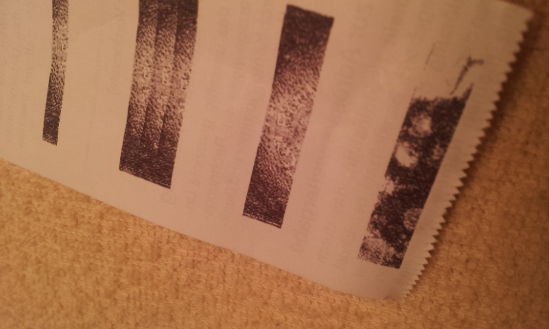

Nachdem meine Bilder irgendwie doch ziemlich falsch formatiert waren, habe ich mit php den Export nach den neuesten Erkenntnissen variiert.

Beim eintragen in den Arduino Code und übertragen sind mir meine zwei Import Nanos immer abgeschmiert, bis ich feststellen musste, dass die dann tatsächlich keine 30000 bytes sondern nur 6500 bytes speichern können. Im allgemeinen weniger ein Problem, da meine Skripte eh nicht so groß werden, aber doch schon ein wenig frech. Wer allerdings ein 5tel bezahlt, sollte sich über ein 5tel Leistung nicht beschweren.

Mein erster Ansatz zum Bilder speichern erfolgte pro Zeile mit dem Wert 0,1,2,3 pro Pixel. Der Gameboy überträgt alles aber irgendwie anders. Ein 16 * 160 Block ist aufgeteilt in 

- 8 Bytepaare für einen 8*8 Pixelblock
- 20 dieser Pixelblöcke für eine Zeile
- 2 Zeilen für einen Informationsschub

__2 Bytes * 8 Linien * 20 Blöcke * 2 Zeilen = 640 Bytes__